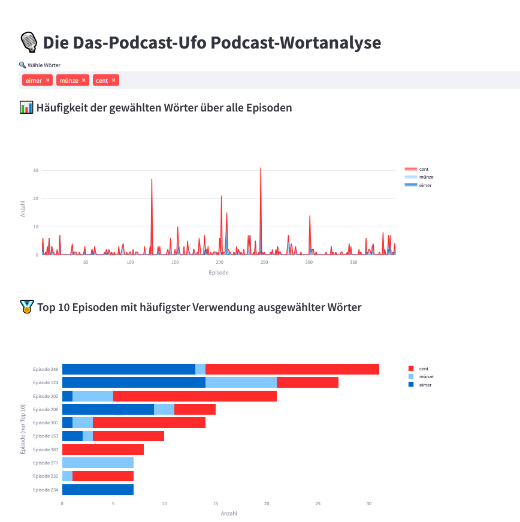

# PUFO_Words

Analyse der Podcast-Episoden von "Das Podcast-Ufo" als Text.
Web App die es erlaubt nachzuschauen welche Wörter in welchen Podcast Folgen wie häufig gesagt wurden. 
Entwickelt, weil ich eine Folge gesucht hatte aber nur noch grob wusste was gesagt wurde.

🚀 **[Zur Podcast Folgen Analyse](https://pufo-words.streamlit.app/)** 🎧



## Projektüberblick

Dieses Projekt lädt alle Episoden aus dem RSS-Feed des Podcasts, transkribiert sie mit Whisper und analysiert die Texte mit spaCy. Die Ergebnisse werden in CSV- und JSON-Dateien gespeichert und können mit einer Streamlit-App interaktiv ausgewertet werden.

- **Transkription:** Whisper wandelt die Audiodateien in Text um.
- **Textanalyse:** spaCy zerlegt die Texte in Lemmata (Wortstämme) und zählt deren Vorkommen.
- **Stoppwörter:** Häufige Wörter wie „und“, „oder“, „das“ werden entfernt.
- **Daten:**  
  - `text`: Enthält die transkribierten Texte aller Episoden.
  - `word_counts.csv`: Enthält, wie oft welches Wort in welcher Episode vorkommt.
  - `episode_stats.json`: Statistiken zu jeder Episode (z. B. Wortanzahl, neue Wörter).
- **Visualisierung:** Mit Streamlit können Wörter gesucht und deren Häufigkeit über die Episoden hinweg visualisiert werden.

## Nutzung

Getestet mit Python 3.11
ffmpeg muss installiert sein

   ```sh
   # Für die Streamlit App
   pip install -r requirements.txt
   streamlit run app.py

   # Für das Verarbeiten neuer Folgen 
   cd episode_processor
   pip install -r requirements.txt
   pip install torch torchvision torchaudio --index-url https://download.pytorch.org/whl/cu121
   python -m spacy download de_core_news_lg
   # Für das Laden und Transkribieren
   python dpu_to_text.py
   # Für das Zählen der Wörter
   python word_counter.py
   ```


## Datenstruktur

- [`word_counts.csv`](word_counts.csv): Matrix mit Wortzählungen pro Episode (ohne Stoppwörter)
- [`episode_stats.json`](episode_stats.json): Enthält für jede Episode:
  - `total_words`: Gesamtzahl der Wörter
  - `unique_words`: Anzahl unterschiedlicher Wörter
  - `new_words`: Neue Wörter in dieser Episode

## Beispiel-Workflow

1. RSS-Feed auslesen und MP3s herunterladen
2. Audiodateien mit Whisper transkribieren
3. Texte mit spaCy tokenisieren und analysieren
4. Ergebnisse in CSV/JSON speichern
5. Streamlit-App zur Auswertung nutzen

## Hinweise

- Für GPU-Beschleunigung wird eine CUDA-fähige Grafikkarte empfohlen.
- Das Verarbiten einer Folge mit Whisper hat ca 20 minuten gedaurt, und lässt sich sicher noch optimieren
- Whisper hat teilweise Probleme mit der genauer Erkennung der Wörter, besonders wenn die beiden durcheinandere sprechen
- Auch spaCy hat probleme mit der lemmatisierung und es werden nicht alle Wörter zum korrekten Wortstamm zusammengefasst 

---
